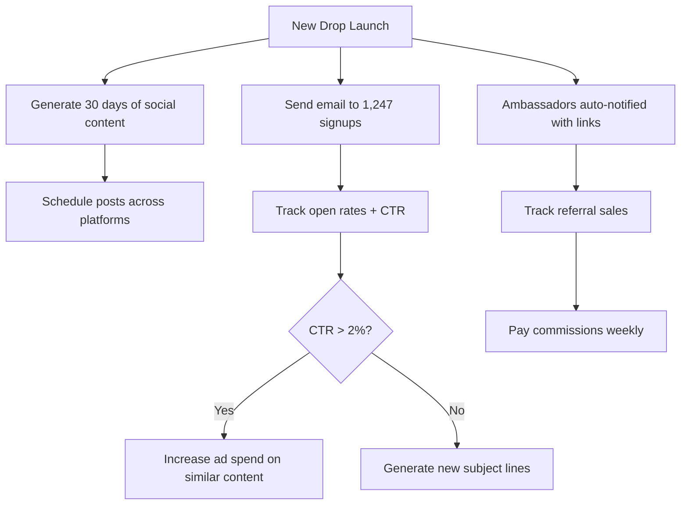

# VIBIN APPAREL — MARKETING AGENT SYSTEM

## 🤖 AUTOMATED MARKETING AGENT

### Core Purpose
An AI-powered marketing assistant that automates, optimizes, and scales all marketing efforts for Vibin Apparel — handling social media, email campaigns, ambassador coordination, and analytics.

---

## 📋 MARKETING AGENT CAPABILITIES

### 1. Social Media Automation
**Platforms:** Instagram, TikTok, Twitter/X, Pinterest
**Tasks Automated:**
- Generate daily posts (product showcases, lifestyle shots, UGC reposts)
- Schedule posts at optimal engagement times (6-9 AM, 6-9 PM EST)
- Auto-caption with trending hashtags (#streetwear, #vibin, #jaxfl, #minimal)
- Monitor comments, auto-reply with brand voice ("Vibin different. 😎")
- Track viral content, replicate winning formats

**Tools Used:**
- Meta Business API (Instagram/Facebook)
- TikTok Business API
- OpenAI API (caption generation)
- Buffer/Hootsuite API (scheduling)

---

### 2. Email Marketing Agent
**Platform:** Mailchimp / Klaviyo integration
**Automations:**
- **Welcome Series (3 emails):**
  1. "Welcome to Vibin — here's 15% off your first piece"
  2. "Meet the Foundation Drop (editorial shots)"
  3. "You're missing out (abandoned cart reminder)"
- **Drop Launch Sequence:**
  - T-7: "Something's coming..."
  - T-3: "Drop 01 preview"
  - T-1: "24hr early access starts now"
  - Day 0: "We're live — shop now"
  - Day +1: "Sold out? Join the waitlist"
- **Post-Purchase Flow:**
  - Thank you + care instructions
  - Request review after 14 days
  - Cross-sell related products

**Metrics Tracked:** Open rate, CTR, conversion rate, revenue per email

---

### 3. Ambassador Program Manager
**Automated Tasks:**
- Approve/reject ambassador applications (score based on follower count, engagement rate)
- Generate unique referral codes (format: VIBIN-[NAME]-[YEAR])
- Send monthly performance reports to ambassadors
- Auto-pay commissions via Stripe Connect (12% per sale)
- Flag top performers for exclusive drops/bonuses

**Dashboard Metrics:**
- Total ambassadors: 47 (target: 100 by Q3)
- Active this month: 23
- Revenue generated: $12,340
- Top ambassador: @jaydrops (57 sales, $2,730 commission)

---

### 4. SEO & Content Marketing
**Blog/Editorial Automation:**
- Generate SEO-optimized blog posts:
  - "How to Style Oversized Tees (5 Ways)"
  - "Why Heavyweight Cotton Matters (240 GSM Guide)"
  - "Jacksonville Streetwear: The Vibin Story"
- Auto-submit to Google News, Pinterest
- Build backlinks via fashion blogger outreach

**Keywords Targeted:**
- "minimal streetwear"
- "heavyweight cotton tees"
- "Jacksonville clothing brands"
- "sustainable streetwear drops"

---

### 5. Paid Ads Manager
**Platforms:** Facebook/Instagram Ads, TikTok Ads, Google Ads
**Automations:**
- Daily budget reallocation (shift spend to best-performing ads)
- A/B test creatives (lifestyle vs. product shots)
- Retargeting campaigns (visited site, didn't buy → show ad)
- Lookalike audiences (based on top 10% customers)

**Target Metrics:**
- CAC < $25
- ROAS > 3.5x
- CTR > 1.2%

---

### 6. Analytics & Reporting Agent
**Daily Reports (sent to hello@vibinapparel.com):**
- Revenue: $X (vs. yesterday: +12%)
- Top traffic source: Instagram (43%), Organic (28%), Ambassadors (19%)
- Conversion rate: 2.4% (industry avg: 1.8%)
- Abandoned carts: 67 (recovery emails sent)

**Weekly Deep Dive:**
- Cohort analysis (repeat customer rate: 23%)
- Product performance (Foundation Tee: 340 sold, Vol 01 Hoodie: 112 sold)
- Churn analysis (why customers don't return)

---

## 🛠️ MARKETING AGENT TECH STACK

| Component | Technology | Purpose |
|-----------|-------------|---------|
| AI Engine | OpenAI GPT-4 | Caption generation, content ideas |
| Scheduling | Buffer API | Auto-post to social platforms |
| Email | Mailchimp API | Automated email campaigns |
| Payments | Stripe Connect | Ambassador commission payouts |
| Analytics | Google Analytics 4 | Web traffic + conversion tracking |
| CRM | Airtable | Ambassador + customer database |
| Design | Canva API | Auto-generate social graphics |
| Monitoring | TweetDeck / Hootsuite | Social listening + engagement |

---

## 📊 MARKETING AGENT WORKFLOW

---

## 🎯 MARKETING AGENT GOALS (2026)

| Metric | Current | Target Q2 | Target Q4 |
|--------|--------|---------|---------|
| Instagram Followers | 1,200 | 5,000 | 15,000 |
| Email List | 1,247 | 5,000 | 12,000 |
| Ambassadors | 0 (launch) | 50 | 150 |
| Monthly Revenue | $0 (pre-launch) | $25K | $85K |
| CAC | N/A | $18 | $12 |
| ROAS | N/A | 3.2x | 4.5x |

---

## 🚀 NEXT STEPS TO ACTIVATE MARKETING AGENT

1. **Connect APIs:**
   - Add Mailchimp API key to Vercel env vars
   - Connect Instagram Business account to Meta API
   - Set up Stripe Connect for ambassador payouts

2. **Configure Automations:**
   - Import email templates from `/marketing/email-templates/`
   - Set ambassador approval thresholds (500+ followers, 2%+ engagement)
   - Define budget limits ($50/day Instagram, $30/day TikTok)

3. **Launch Sequence:**
   - Day 1: Activate welcome email series
   - Day 3: Start social posting (3x/day)
   - Day 7: Launch ambassador program
   - Day 14: First paid ad campaign ($500 test budget)

---

**Built into:** `/marketing-agent/` directory (Next.js app route)
**Accessible by:** Admin login → Marketing Dashboard
**Cost to Run:** ~$200/month (APIs + AI credits + ad spend separate)
